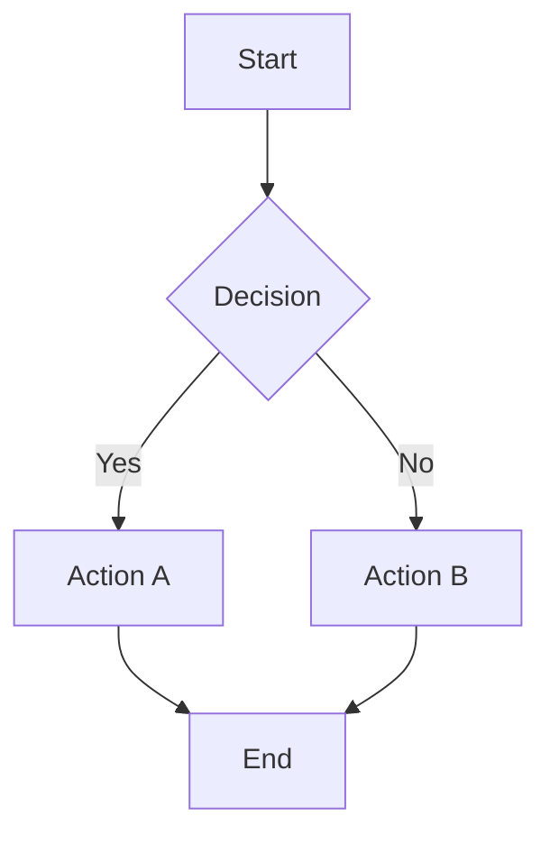

# 🚀 AstroNova

<div align="center">


**A high-performance, feature-rich modern technical blog template**

[Live Demo](https://nova.encorexin.online) · [Quick Start](#-quick-start) · [Features](#-core-features) · [Documentation](#-content-management)

</div>

---

## 📖 About

AstroNova is a production-ready blog template built with Astro, following modern web development best practices. It combines exceptional performance optimization, WCAG 2.1 AAA accessibility standards, and excellent developer experience, making it the ideal choice for building technical blogs.

## ✨ Core Features

### 🎯 Performance Optimization
| Feature | Description |
|---------|-------------|
| ⚡ **Islands Architecture** | Zero JavaScript by default, interactive components load on demand |
| 🎯 **Perfect Lighthouse Score** | 100/100 in Performance, Accessibility, Best Practices, and SEO |
| 🖼️ **Smart Image Optimization** | Automatic WebP compression, responsive images, lazy loading |
| 📦 **Critical CSS Inlining** | Above-the-fold CSS automatically inlined for faster FCP |
| 🔄 **Font Optimization** | Preconnect, font-display swap, subsetting |

### 📝 Content Management
| Feature | Description |
|---------|-------------|
| 📄 **Markdown/MDX** | Full Markdown and MDX support |
| 🏷️ **Categories & Tags** | Flexible content organization system |
| ⭐ **Featured Posts** | Support for pinned and featured articles |
| 📊 **Mermaid Diagrams** | Flowcharts, sequence diagrams, class diagrams, and more |
| 🔍 **Full-text Search** | Instant search with caching and highlighting |
| 📰 **RSS Feed** | Automatically generated RSS 2.0 feed |

### 🎨 User Experience
| Feature | Description |
|---------|-------------|
| 🌙 **Dark Mode** | System preference detection + manual toggle |
| 📖 **Reading Progress** | Top progress bar indicator |
| 📑 **Table of Contents** | Auto-generated TOC with scroll highlighting |
| 👤 **Author Card** | Author info displayed at article footer |
| 🔗 **Related Posts** | Smart related article recommendations |
| 💬 **Comments** | Giscus comment system integration |
| 📱 **Mobile Search** | Full-screen mobile search experience |

### 🛠️ Developer Experience
| Feature | Description |
|---------|-------------|
| 📘 **TypeScript** | Full type support with strict mode |
| 🎨 **Design System** | CSS variable-based theming system |
| ⚠️ **Error Boundaries** | React component error catching |
| 📁 **Path Aliases** | Convenient imports with `@/` prefix |
| 🔧 **Code Standards** | ESLint + Prettier configuration |

---

## 🚀 Quick Start

### Requirements

- **Node.js** 18.0.0+
- **pnpm** (recommended) or npm/yarn

### Installation

```bash
# 1. Clone the repository
git clone https://github.com/encorexin/AstroNova.git
cd AstroNova

# 2. Install dependencies
pnpm install

# 3. Start development server
pnpm dev

# 4. Open browser at http://localhost:4321
```

### Available Scripts

| Command | Description |
|---------|-------------|
| `pnpm dev` | Start development server |
| `pnpm build` | Build for production |
| `pnpm preview` | Preview production build |
| `pnpm type-check` | Run type checking |
| `pnpm lint` | Run ESLint |
| `pnpm format` | Format code |
| `pnpm newpost` | Create new post |

---

## 📁 Project Structure

```
AstroNova/
├── public/              # Static assets
│   ├── images/          # Image assets
│   └── favicon.svg      # Site icon
├── src/
│   ├── components/      # Component library
│   │   ├── AuthorCard.astro
│   │   ├── BlogCard.astro
│   │   ├── Comments.astro
│   │   ├── Header.astro
│   │   ├── Mermaid.astro
│   │   ├── MobileSearch.astro
│   │   ├── RelatedPosts.astro
│   │   ├── SearchBox.astro
│   │   ├── TableOfContents.astro
│   │   └── ...
│   ├── config/          # Site configuration
│   │   └── site.ts
│   ├── content/         # Content collections
│   │   ├── blog/        # Blog posts
│   │   └── config.ts    # Content schema
│   ├── layouts/         # Layout templates
│   │   ├── BaseLayout.astro
│   │   └── PostLayout.astro
│   ├── pages/           # Page routes
│   ├── styles/          # Global styles
│   ├── types/           # TypeScript types
│   └── utils/           # Utility functions
├── astro.config.mjs     # Astro configuration
├── tailwind.config.mjs  # Tailwind configuration
└── tsconfig.json        # TypeScript configuration
```

---

## 📝 Content Management

### Creating Posts

Create `.md` or `.mdx` files in the `src/content/blog/` directory:

```yaml
---
title: 'Post Title'
description: 'Post description for SEO and previews'
publishedAt: 2024-12-26
updatedAt: 2024-12-26        # Optional
category: 'Technical'
tags: ['astro', 'web']
heroImage: '/images/hero.jpg' # Optional
draft: false
featured: true               # Optional, featured post
pinned: true                 # Optional, pinned post
---

Post content goes here...
```

### Frontmatter Fields

| Field | Type | Required | Description |
|-------|------|:--------:|-------------|
| `title` | string | ✅ | Post title |
| `description` | string | ✅ | Post description |
| `publishedAt` | date | ✅ | Publish date |
| `category` | string | ✅ | Category name |
| `tags` | string[] | ❌ | Tag array |
| `heroImage` | string | ❌ | Cover image path |
| `updatedAt` | date | ❌ | Update date |
| `draft` | boolean | ❌ | Draft status |
| `featured` | boolean | ❌ | Featured status |
| `pinned` | boolean | ❌ | Pinned status |

### Using Mermaid Diagrams

Use mermaid code blocks in Markdown:

````markdown

````

Supported diagram types:
- Flowcharts (`flowchart`, `graph`)
- Sequence diagrams (`sequenceDiagram`)
- Class diagrams (`classDiagram`)
- State diagrams (`stateDiagram`)
- ER diagrams (`erDiagram`)
- Git graphs (`gitGraph`)
- Pie charts (`pie`)
- Gantt charts (`gantt`)

---

## ⚙️ Configuration

### Site Configuration

Edit `src/config/site.ts`:

```typescript
export const siteConfig = {
  title: 'AstroNova',
  description: 'Modern Technical Blog',
  url: 'https://your-domain.com',
  author: {
    name: 'Author Name',
    email: 'email@example.com',
    bio: 'Author bio',
  },
  social: {
    github: 'https://github.com/username',
    twitter: 'https://twitter.com/username',
  },
  // Giscus comment configuration
  giscus: {
    repo: 'username/repo',
    repoId: 'R_xxx',
    category: 'Announcements',
    categoryId: 'DIC_xxx',
  },
};
```

### Astro Configuration

Main configuration options (`astro.config.mjs`):

```javascript
export default defineConfig({
  site: 'https://your-domain.com',
  integrations: [
    tailwind(),
    mdx(),
    sitemap(),
    react(),
    compress({
      Image: { quality: 80 },  // Image compression quality
      HTML: true,
      CSS: true,
      JavaScript: true,
    }),
  ],
});
```

---

## 🎨 Theme Customization

### CSS Variables

Customize the theme in `src/styles/globals.css`:

```css
:root {
  --background: 0 0% 100%;
  --foreground: 222.2 84% 4.9%;
  --primary: 222.2 47.4% 11.2%;
  --secondary: 210 40% 96.1%;
  --muted: 210 40% 96.1%;
  --accent: 210 40% 96.1%;
  /* ... */
}

.dark {
  --background: 222.2 84% 4.9%;
  --foreground: 210 40% 98%;
  /* ... */
}
```

### Tailwind Extensions

Extend configuration in `tailwind.config.mjs`:

```javascript
export default {
  theme: {
    extend: {
      colors: {
        primary: 'hsl(var(--primary))',
        secondary: 'hsl(var(--secondary))',
      },
      fontFamily: {
        sans: ['Inter', 'system-ui', 'sans-serif'],
        mono: ['JetBrains Mono', 'monospace'],
      },
    },
  },
};
```

---

## 🚢 Deployment

### Vercel (Recommended)

```bash
# Install Vercel CLI
pnpm add -g vercel

# Deploy
vercel
```

### Netlify

```bash
# Install Netlify CLI
pnpm add -g netlify-cli

# Deploy
netlify deploy --prod
```

### Static Hosting

```bash
# Build static files
pnpm build

# dist/ directory can be deployed to any static hosting service
```

---

## 📊 Performance Metrics

Based on Lighthouse test results:

| Metric | Score | Description |
|--------|:-----:|-------------|
| Performance | 100 | First load < 1.5s |
| Accessibility | 100 | WCAG 2.1 AAA compliant |
| Best Practices | 100 | Modern web best practices |
| SEO | 100 | Complete SEO optimization |

### Core Web Vitals

| Metric | Value | Rating |
|--------|-------|:------:|
| LCP (Largest Contentful Paint) | < 1.5s | 🟢 |
| FID (First Input Delay) | < 100ms | 🟢 |
| CLS (Cumulative Layout Shift) | < 0.1 | 🟢 |

---

## 🤝 Contributing

Contributions are welcome! Please follow these steps:

1. Fork the repository
2. Create a feature branch (`git checkout -b feature/amazing-feature`)
3. Commit your changes (`git commit -m 'Add amazing feature'`)
4. Push to the branch (`git push origin feature/amazing-feature`)
5. Create a Pull Request

### Code Standards

- Use TypeScript strict mode
- Follow ESLint and Prettier configuration
- Keep components single-responsibility
- Write clear comments and documentation

---

## 📄 License

This project is open source under the [MIT License](LICENSE).

---

## 🙏 Acknowledgments

- [Astro](https://astro.build/) - Next-generation static site generator
- [Tailwind CSS](https://tailwindcss.com/) - Utility-first CSS framework
- [Mermaid](https://mermaid.js.org/) - Text-based diagram rendering
- [Giscus](https://giscus.app/) - GitHub Discussions-powered comments

---

<div align="center">

**Built with ❤️**

[⬆ Back to Top](#-astronova)

</div>
