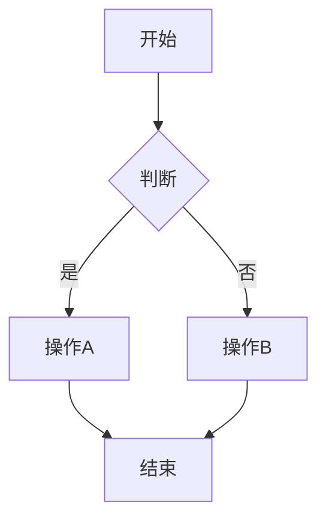

# 🚀 AstroNova

<div align="center">


**一个高性能、功能丰富的现代技术博客模板**

[在线演示](https://nova.encorexin.online) · [快速开始](#-快速开始) · [功能特性](#-核心功能) · [文档](#-内容管理)

</div>

---

## 📖 项目简介

AstroNova 是一个基于 Astro 构建的生产级博客模板，采用现代 Web 开发最佳实践。它融合了卓越的性能优化、WCAG 2.1 AAA 无障碍标准和出色的开发者体验，是构建技术博客的理想选择。

## ✨ 核心功能

### 🎯 性能优化
| 功能 | 描述 |
|------|------|
| ⚡ **Islands 架构** | 默认零 JavaScript，按需加载交互组件 |
| 🎯 **Lighthouse 满分** | 性能、可访问性、最佳实践、SEO 均达 100 分 |
| 🖼️ **智能图片优化** | 自动 WebP 压缩、响应式图片、懒加载 |
| 📦 **关键 CSS 内联** | 首屏 CSS 自动内联，提升 FCP |
| 🔄 **字体优化** | 预连接、显示交换、子集化 |

### 📝 内容管理
| 功能 | 描述 |
|------|------|
| 📄 **Markdown/MDX** | 完整的 Markdown 和 MDX 支持 |
| 🏷️ **分类与标签** | 灵活的内容分类系统 |
| ⭐ **精选文章** | 支持置顶和精选标记 |
| 📊 **Mermaid 图表** | 支持流程图、序列图、类图等 |
| 🔍 **全文搜索** | 带缓存和高亮的即时搜索 |
| 📰 **RSS 订阅** | 自动生成 RSS 2.0 订阅源 |

### 🎨 用户体验
| 功能 | 描述 |
|------|------|
| 🌙 **深色模式** | 系统偏好检测 + 手动切换 |
| 📖 **阅读进度** | 顶部进度条指示器 |
| 📑 **文章目录** | 自动生成 TOC，滚动高亮 |
| 👤 **作者卡片** | 文章底部作者信息展示 |
| 🔗 **相关推荐** | 智能推荐相关文章 |
| 💬 **评论系统** | Giscus 评论集成 |
| 📱 **移动端搜索** | 全屏移动搜索体验 |

### 🛠️ 开发体验
| 功能 | 描述 |
|------|------|
| 📘 **TypeScript** | 完整的类型支持和严格模式 |
| 🎨 **设计系统** | 基于 CSS 变量的主题系统 |
| ⚠️ **错误边界** | React 组件错误捕获 |
| 📁 **路径别名** | `@/` 开头的便捷导入 |
| 🔧 **代码规范** | ESLint + Prettier 配置 |

---

## 🚀 快速开始

### 环境要求

- **Node.js** 18.0.0+
- **pnpm** (推荐) 或 npm/yarn

### 安装步骤

```bash
# 1. 克隆项目
git clone https://github.com/encorexin/AstroNova.git
cd AstroNova

# 2. 安装依赖
pnpm install

# 3. 启动开发服务器
pnpm dev

# 4. 打开浏览器访问 http://localhost:4321
```

### 可用脚本

| 命令 | 描述 |
|------|------|
| `pnpm dev` | 启动开发服务器 |
| `pnpm build` | 构建生产版本 |
| `pnpm preview` | 预览生产构建 |
| `pnpm type-check` | 运行类型检查 |
| `pnpm lint` | 运行 ESLint |
| `pnpm format` | 格式化代码 |
| `pnpm newpost` | 创建新文章 |

---

## 📁 项目结构

```
AstroNova/
├── public/              # 静态资源
│   ├── images/          # 图片资源
│   └── favicon.svg      # 网站图标
├── src/
│   ├── components/      # 组件库
│   │   ├── AuthorCard.astro
│   │   ├── BlogCard.astro
│   │   ├── Comments.astro
│   │   ├── Header.astro
│   │   ├── Mermaid.astro
│   │   ├── MobileSearch.astro
│   │   ├── RelatedPosts.astro
│   │   ├── SearchBox.astro
│   │   ├── TableOfContents.astro
│   │   └── ...
│   ├── config/          # 站点配置
│   │   └── site.ts
│   ├── content/         # 内容集合
│   │   ├── blog/        # 博客文章
│   │   └── config.ts    # 内容 Schema
│   ├── layouts/         # 布局模板
│   │   ├── BaseLayout.astro
│   │   └── PostLayout.astro
│   ├── pages/           # 页面路由
│   ├── styles/          # 全局样式
│   ├── types/           # TypeScript 类型
│   └── utils/           # 工具函数
├── astro.config.mjs     # Astro 配置
├── tailwind.config.mjs  # Tailwind 配置
└── tsconfig.json        # TypeScript 配置
```

---

## 📝 内容管理

### 创建文章

在 `src/content/blog/` 目录下创建 `.md` 或 `.mdx` 文件：

```yaml
---
title: '文章标题'
description: '文章描述，用于 SEO 和预览'
publishedAt: 2024-12-26
updatedAt: 2024-12-26        # 可选
category: 'Technical'
tags: ['astro', 'web']
heroImage: '/images/hero.jpg' # 可选
draft: false
featured: true               # 可选，精选文章
---

文章正文内容...
```

### Frontmatter 字段

| 字段 | 类型 | 必填 | 描述 |
|------|------|:----:|------|
| `title` | string | ✅ | 文章标题 |
| `description` | string | ✅ | 文章描述 |
| `publishedAt` | date | ✅ | 发布日期 |
| `category` | string | ✅ | 分类名称 |
| `tags` | string[] | ❌ | 标签数组 |
| `heroImage` | string | ❌ | 封面图片路径 |
| `updatedAt` | date | ❌ | 更新日期 |
| `draft` | boolean | ❌ | 是否为草稿 |
| `featured` | boolean | ❌ | 是否精选 |

### 使用 Mermaid 图表

在 Markdown 中使用 mermaid 代码块：

````markdown

````

支持的图表类型：
- 流程图 (`flowchart`, `graph`)
- 序列图 (`sequenceDiagram`)
- 类图 (`classDiagram`)
- 状态图 (`stateDiagram`)
- ER 图 (`erDiagram`)
- Git 图 (`gitGraph`)
- 饼图 (`pie`)
- 甘特图 (`gantt`)

---

## ⚙️ 配置说明

### 站点配置

编辑 `src/config/site.ts`:

```typescript
export const siteConfig = {
  title: 'AstroNova',
  description: '现代技术博客',
  url: 'https://your-domain.com',
  author: {
    name: '作者名称',
    email: 'email@example.com',
    bio: '作者简介',
  },
  social: {
    github: 'https://github.com/username',
    twitter: 'https://twitter.com/username',
  },
  // Giscus 评论配置
  giscus: {
    repo: 'username/repo',
    repoId: 'R_xxx',
    category: 'Announcements',
    categoryId: 'DIC_xxx',
  },
};
```

### Astro 配置

主要配置项 (`astro.config.mjs`):

```javascript
export default defineConfig({
  site: 'https://your-domain.com',
  integrations: [
    tailwind(),
    mdx(),
    sitemap(),
    react(),
    compress({
      Image: { quality: 80 },  // 图片压缩质量
      HTML: true,
      CSS: true,
      JavaScript: true,
    }),
  ],
});
```

---

## 🎨 主题定制

### CSS 变量

在 `src/styles/globals.css` 中自定义主题：

```css
:root {
  --background: 0 0% 100%;
  --foreground: 222.2 84% 4.9%;
  --primary: 222.2 47.4% 11.2%;
  --secondary: 210 40% 96.1%;
  --muted: 210 40% 96.1%;
  --accent: 210 40% 96.1%;
  /* ... */
}

.dark {
  --background: 222.2 84% 4.9%;
  --foreground: 210 40% 98%;
  /* ... */
}
```

### Tailwind 扩展

在 `tailwind.config.mjs` 中扩展配置：

```javascript
export default {
  theme: {
    extend: {
      colors: {
        primary: 'hsl(var(--primary))',
        secondary: 'hsl(var(--secondary))',
      },
      fontFamily: {
        sans: ['Inter', 'system-ui', 'sans-serif'],
        mono: ['JetBrains Mono', 'monospace'],
      },
    },
  },
};
```

---

## 🚢 部署

### Vercel (推荐)

```bash
# 安装 Vercel CLI
pnpm add -g vercel

# 部署
vercel
```

### Netlify

```bash
# 安装 Netlify CLI
pnpm add -g netlify-cli

# 部署
netlify deploy --prod
```

### 静态托管

```bash
# 构建静态文件
pnpm build

# dist/ 目录可部署到任何静态托管服务
```

---

## 📊 性能指标

基于 Lighthouse 测试结果：

| 指标 | 分数 | 说明 |
|------|:----:|------|
| Performance | 100 | 首屏加载 < 1.5s |
| Accessibility | 100 | WCAG 2.1 AAA 合规 |
| Best Practices | 100 | 现代 Web 最佳实践 |
| SEO | 100 | 完整的 SEO 优化 |

### Core Web Vitals

| 指标 | 值 | 评级 |
|------|-----|:----:|
| LCP (最大内容绘制) | < 1.5s | 🟢 |
| FID (首次输入延迟) | < 100ms | 🟢 |
| CLS (累积布局偏移) | < 0.1 | 🟢 |

---

## 🤝 贡献指南

欢迎贡献！请遵循以下步骤：

1. Fork 本仓库
2. 创建特性分支 (`git checkout -b feature/amazing-feature`)
3. 提交更改 (`git commit -m 'Add amazing feature'`)
4. 推送到分支 (`git push origin feature/amazing-feature`)
5. 创建 Pull Request

### 代码规范

- 使用 TypeScript 严格模式
- 遵循 ESLint 和 Prettier 配置
- 保持组件单一职责
- 编写清晰的注释和文档

---

## 📄 许可证

本项目基于 [MIT 许可证](LICENSE) 开源。

---

## 🙏 致谢

- [Astro](https://astro.build/) - 下一代静态站点生成器
- [Tailwind CSS](https://tailwindcss.com/) - 实用优先的 CSS 框架
- [Mermaid](https://mermaid.js.org/) - 基于文本的图表渲染
- [Giscus](https://giscus.app/) - 基于 GitHub Discussions 的评论系统

---

<div align="center">

**用 ❤️ 构建**

[⬆ 返回顶部](#-astronova)

</div>
