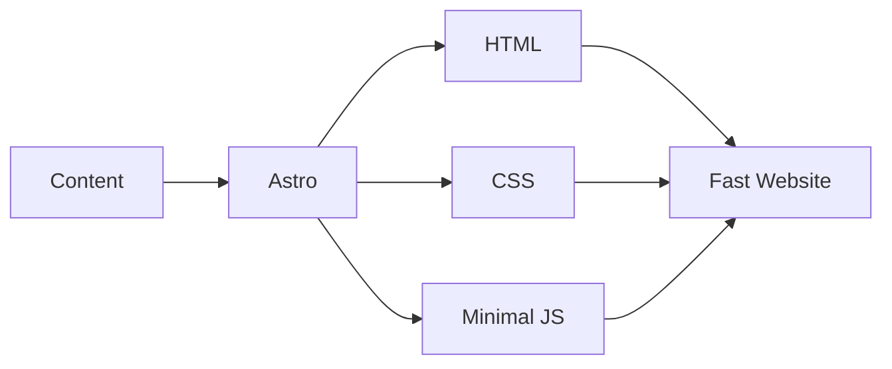

# Getting Started with Astro

Welcome to the first part of our comprehensive Astro tutorial series! In this series, we'll take you from complete beginner to building production-ready websites with Astro.

## What is Astro?

Astro is a modern static site generator that offers:

- **Zero JavaScript by Default** - Ship only the HTML and CSS you need
- **Islands Architecture** - Interactive components load on demand
- **Framework Agnostic** - Use React, Vue, Svelte, or vanilla JS
- **Content-Focused** - Built for content-rich websites

## Why Choose Astro?



### Performance Benefits

| Metric | Traditional SPA | Astro |
|--------|-----------------|-------|
| Initial Load | 200-500KB JS | ~0KB JS |
| Time to Interactive | 3-5s | <1s |
| Core Web Vitals | Variable | Excellent |

## Installation

Getting started with Astro is straightforward:

```bash
# Create a new project
npm create astro@latest my-astro-site

# Navigate to project
cd my-astro-site

# Start development server
npm run dev
```

## Project Structure

A typical Astro project looks like this:

```
my-astro-site/
├── public/          # Static assets
├── src/
│   ├── components/  # UI components
│   ├── layouts/     # Page layouts
│   └── pages/       # File-based routing
├── astro.config.mjs # Configuration
└── package.json
```

## Next Steps

In the next part of this series, we'll dive deeper into:
- Creating your first component
- Understanding Astro's file-based routing
- Working with layouts

Stay tuned for Part 2!

---

*This is Part 1 of the Astro Tutorial Series. [Continue to Part 2 →](/blog/astro-tutorial-components)*
