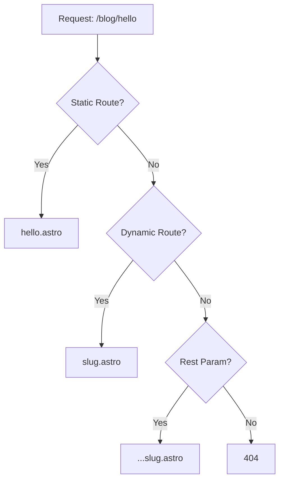

# Routing in Astro

Welcome to Part 3 of our Astro tutorial series! Understanding routing is essential for building multi-page applications.

## File-based Routing

Astro uses a file-based routing system:

```
src/pages/
├── index.astro       → /
├── about.astro       → /about
├── blog/
│   ├── index.astro   → /blog
│   └── post-1.astro  → /blog/post-1
└── contact.astro     → /contact
```

## Static Routes

Create a simple page:

```astro
---
// src/pages/about.astro
import Layout from '../layouts/Layout.astro';
---

<Layout title="About Us">
  <h1>About Our Company</h1>
  <p>We build amazing websites with Astro.</p>
</Layout>
```

## Dynamic Routes

Use square brackets for dynamic segments:

```astro
---
// src/pages/blog/[slug].astro
import { getCollection } from 'astro:content';

export async function getStaticPaths() {
  const posts = await getCollection('blog');
  return posts.map(post => ({
    params: { slug: post.slug },
    props: { post },
  }));
}

const { post } = Astro.props;
const { Content } = await post.render();
---

<article>
  <h1>{post.data.title}</h1>
  <Content />
</article>
```

## Rest Parameters

Catch all remaining path segments:

```astro
---
// src/pages/docs/[...path].astro
export async function getStaticPaths() {
  return [
    { params: { path: 'getting-started' } },
    { params: { path: 'guides/installation' } },
    { params: { path: 'api/components/button' } },
  ];
}

const { path } = Astro.params;
---

<h1>Documentation: {path}</h1>
```

## Route Priority

Astro follows these priority rules:



## API Endpoints

Create REST API endpoints:

```typescript
// src/pages/api/posts.json.ts
import type { APIRoute } from 'astro';
import { getCollection } from 'astro:content';

export const GET: APIRoute = async () => {
  const posts = await getCollection('blog');
  
  return new Response(
    JSON.stringify(posts.map(p => ({
      slug: p.slug,
      title: p.data.title,
      date: p.data.publishedAt,
    }))),
    {
      status: 200,
      headers: {
        'Content-Type': 'application/json',
      },
    }
  );
};
```

## Redirects

Configure redirects in `astro.config.mjs`:

```javascript
export default defineConfig({
  redirects: {
    '/old-page': '/new-page',
    '/blog/[...slug]': '/posts/[...slug]',
  },
});
```

Or programmatically:

```astro
---
return Astro.redirect('/new-url', 301);
---
```

## 404 Pages

Create a custom 404 page:

```astro
---
// src/pages/404.astro
import Layout from '../layouts/Layout.astro';
---

<Layout title="Page Not Found">
  <div class="error-container">
    <h1>404</h1>
    <p>Oops! Page not found.</p>
    <a href="/">Go home</a>
  </div>
</Layout>
```

## Summary

You've learned:
- ✅ Static file-based routing
- ✅ Dynamic routes with parameters
- ✅ Rest parameters for catch-all routes
- ✅ Creating API endpoints
- ✅ Handling redirects and 404s

---

*This is Part 3 of the Astro Tutorial Series. [← Back to Part 2](/blog/astro-tutorial-components)*

**Congratulations!** You've completed the Astro Tutorial Series. You're now ready to build amazing websites with Astro!
