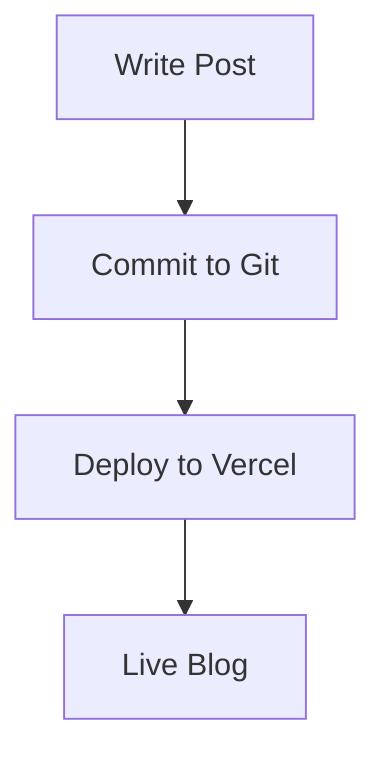

In the modern web development landscape, content management often forces a choice between simplicity and power. This blog demonstrates how you can have both—leveraging the simplicity of Markdown with the sophistication of a full-featured content management system.

## The Philosophy: Developer Happiness First

Our content architecture is built on three principles:

- **Content as Code**: Version-controlled, reviewable, and deployable content
- **Type Safety**: Full TypeScript support for content schemas
- **Zero Configuration**: Write content in Markdown, get a production-ready blog

## Content Architecture Overview

### Type-Safe Content with Astro

Astro's content collections provide type safety for all your content:

```typescript
// src/content/config.ts
import { defineCollection, z } from 'astro:content'

const blogCollection = defineCollection({
  type: 'content',
  schema: z.object({
    title: z.string(),
    description: z.string(),
    publishedAt: z.date(),
    category: z.string(),
    tags: z.array(z.string()),
    heroImage: z.string().optional(),
    draft: z.boolean().default(false),
  }),
})

export const collections = {
  blog: blogCollection,
}
```

### IntelliSense for Content

With TypeScript integration, you get full IntelliSense support:

```markdown
---
title: 'Your Post Title' // ✅ Autocomplete available
description: '...'      // ✅ Type checking
category: '...'        // ✅ Suggestions from existing categories
tags: ['...']          // ✅ Array type validation
---
```

## Markdown Superpowers

### Extended Markdown Features

Our setup enhances standard Markdown with powerful features:

#### Syntax Highlighting

```javascript
// Automatic syntax highlighting
const fibonacci = (n) => {
  if (n <= 1) return n
  return fibonacci(n - 1) + fibonacci(n - 2)
}
```

#### Mermaid Diagrams



#### Mathematical Expressions

When you need to include mathematical content:

```latex
\text{Performance Score} = \frac{\text{FCP} + \text{TTI} + \text{CLS}}{3}
```

### Custom Components in Markdown

Embed React components directly in your Markdown:

```markdown
<InteractiveDemo 
  title="Performance Calculator"
  metrics={['FCP', 'TTI', 'CLS']}
/>
```

## Hot Reload Development Experience

### Instant Feedback Loop

Changes reflect immediately during development:

```bash
# Start development server
pnpm dev

# Edit any .md file and see changes instantly
# No browser refresh required
```

### Live Preview Features

- **Real-time rendering** of Markdown content
- **Component hot swapping** without page reload
- **Image optimization preview** during development

## Content Workflow

### 1. Writing Content

Create new posts with our template:

```markdown
---
title: 'Your Amazing Post'
description: 'A compelling description that appears in search results'
publishedAt: 2024-12-18
category: 'Tutorial'
tags: ['astro', 'markdown', 'tutorial']
heroImage: '/images/your-image.jpg'
draft: false
---

## Introduction

Your content here... The system handles everything else.
```

### 2. Automatic Image Processing

Images are automatically optimized:

```markdown

<!-- Automatically generates responsive images -->
```

### 3. SEO Optimization

Every post gets automatic SEO optimization:

- **Meta tags** generation from frontmatter
- **Open Graph** tags for social sharing
- **Structured data** for search engines
- **Sitemap** generation
- **RSS feed** creation

## Advanced Content Features

### Content Relationships

Link related content automatically:

```typescript
// Get related posts by category
const relatedPosts = await getCollection('blog', ({ data }) => 
  data.category === post.data.category && data.title !== post.data.title
)
```

### Scheduled Publishing

Publish content at specific times:

```typescript
// Filter draft posts and future dates
const publishedPosts = allPosts.filter(post => 
  !post.data.draft && post.data.publishedAt <= new Date()
)
```

### Content Validation

Automated content validation prevents common issues:

```typescript
// Validate required fields
const validatePost = (post: CollectionEntry<'blog'>) => {
  const required = ['title', 'description', 'publishedAt']
  return required.every(field => post.data[field])
}
```

## Deployment Workflow

### Git-Based Publishing

The deployment process is seamless:

```bash
# Write content
git add src/content/blog/my-new-post.md
git commit -m "Add new blog post about modern DX"
git push origin main

# Automatic deployment to production
```

### Branch Previews

Every pull request gets a preview deployment:

```bash
# Create feature branch
git checkout -b feature/new-post
git push origin feature/new-post

# Automatic preview URL generated
```

## Performance Benefits

### Build-Time Optimization

Content is processed at build time for maximum performance:

- **Static HTML generation** for every post
- **Automatic image optimization** with modern formats
- **CSS purging** for unused styles
- **JavaScript bundling** with code splitting

### Content Delivery Network

Optimized content delivery:

- **Global CDN** distribution
- **Asset fingerprinting** for cache busting
- **Compression** (gzip/brotli)
- **HTTP/2 push** for critical resources

## Developer Tools Integration

### VS Code Extensions

Recommended extensions for optimal DX:

```json
{
  "recommendations": [
    "astro-build.astro-vscode",
    "bradlc.vscode-tailwindcss",
    "esbenp.prettier-vscode",
    "ms-vscode.vscode-typescript-next"
  ]
}
```

### Linting and Formatting

Automated code quality:

```bash
# Check content quality
pnpm lint:content

# Format all content
pnpm format:content
```

## Migration and Import Tools

### From Other Platforms

Easy migration from other platforms:

```typescript
// Import from WordPress
const importFromWordPress = async (xmlFile: string) => {
  // Parse WordPress export
  // Convert to Markdown
  // Generate frontmatter
}

// Import from Medium
const importFromMedium = async (url: string) => {
  // Fetch Medium content
  // Convert to Markdown format
  // Preserve formatting
}
```

### Bulk Operations

Handle large content migrations:

```bash
# Batch process images
pnpm optimize:images

# Generate thumbnails
pnpm generate:thumbnails

# Validate all content
pnpm validate:content
```

## Analytics and Insights

### Content Performance Tracking

Monitor content performance:

```typescript
interface ContentMetrics {
  views: number
  readingTime: number
  engagement: number
  socialShares: number
}
```

### A/B Testing Content

Test different content approaches:

```typescript
// Test different titles
const titleVariants = [
  "Modern Developer Experience",
  "Developer Experience Revolution",
  "The Future of Content Management"
]
```

## Future Enhancements

### Planned Features

- **Content versioning** with git-based history
- **Collaborative editing** with real-time sync
- **Rich media embedding** with video/audio support
- **Interactive demos** with live code execution
- **Content translation** with i18n support

### AI-Assisted Writing

Future AI integration:

- **Auto-completion** for technical content
- **SEO optimization** suggestions
- **Grammar and style** checking
- **Content summarization** tools

## Key Takeaways

This content management system proves that you don't need to sacrifice developer experience for content management power. By leveraging:

- **Type-safe content** with Astro collections
- **Git-based workflows** for version control
- **Markdown simplicity** with component power
- **Automatic optimizations** for performance
- **Zero-configuration** setup

You get a content management system that's both **developer-friendly** and **content-creator-optimized**.

The result is a blogging platform where writing content feels natural, deployment is automatic, and performance is exceptional—all while maintaining the simplicity and power that modern developers expect.

---

*Ready to start your own developer-friendly blog? Check out our [getting started guide](/getting-started) and [advanced configuration docs](/configuration).*