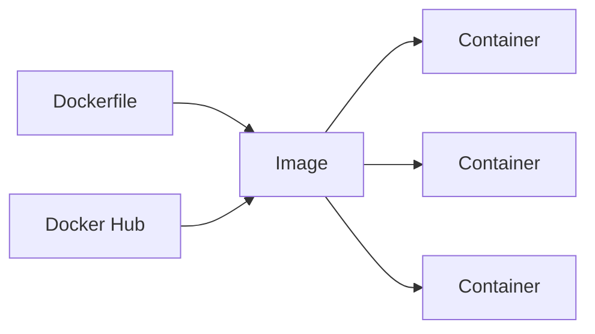

# Docker for Web Developers

Docker simplifies development and deployment. Let's explore practical Docker usage for web developers.

## Why Docker?

| Problem | Docker Solution |
|---------|-----------------|
| "Works on my machine" | Consistent environments |
| Dependency conflicts | Isolated containers |
| Complex setup | Single command startup |
| Deployment issues | Build once, run anywhere |

## Core Concepts



- **Dockerfile**: Blueprint for building images
- **Image**: Read-only template
- **Container**: Running instance of an image
- **Registry**: Storage for images (Docker Hub)

## Your First Dockerfile

### Node.js Application

```dockerfile
# Use official Node.js image
FROM node:20-alpine

# Set working directory
WORKDIR /app

# Copy package files
COPY package*.json ./

# Install dependencies
RUN npm ci --only=production

# Copy application code
COPY . .

# Expose port
EXPOSE 3000

# Start application
CMD ["node", "server.js"]
```

### Multi-Stage Build (Optimized)

```dockerfile
# Build stage
FROM node:20-alpine AS builder
WORKDIR /app
COPY package*.json ./
RUN npm ci
COPY . .
RUN npm run build

# Production stage
FROM node:20-alpine AS runner
WORKDIR /app
COPY --from=builder /app/dist ./dist
COPY --from=builder /app/node_modules ./node_modules
EXPOSE 3000
CMD ["node", "dist/server.js"]
```

## Essential Docker Commands

```bash
# Build an image
docker build -t my-app:latest .

# Run a container
docker run -d -p 3000:3000 --name my-app my-app:latest

# View running containers
docker ps

# View logs
docker logs -f my-app

# Stop container
docker stop my-app

# Remove container
docker rm my-app

# Remove image
docker rmi my-app:latest
```

## Docker Compose for Development

```yaml
# docker-compose.yml
version: '3.8'

services:
  app:
    build: .
    ports:
      - "3000:3000"
    volumes:
      - .:/app
      - /app/node_modules
    environment:
      - NODE_ENV=development
      - DATABASE_URL=postgres://postgres:password@db:5432/myapp
    depends_on:
      - db
      - redis

  db:
    image: postgres:15-alpine
    ports:
      - "5432:5432"
    environment:
      - POSTGRES_USER=postgres
      - POSTGRES_PASSWORD=password
      - POSTGRES_DB=myapp
    volumes:
      - postgres_data:/var/lib/postgresql/data

  redis:
    image: redis:7-alpine
    ports:
      - "6379:6379"

volumes:
  postgres_data:
```

### Compose Commands

```bash
# Start all services
docker-compose up -d

# View logs
docker-compose logs -f app

# Stop all services
docker-compose down

# Rebuild and restart
docker-compose up -d --build

# Run command in container
docker-compose exec app npm test
```

## Development vs Production

### Development Dockerfile

```dockerfile
FROM node:20-alpine
WORKDIR /app
COPY package*.json ./
RUN npm install
COPY . .
CMD ["npm", "run", "dev"]
```

### Production Dockerfile

```dockerfile
FROM node:20-alpine AS builder
WORKDIR /app
COPY package*.json ./
RUN npm ci
COPY . .
RUN npm run build
RUN npm prune --production

FROM node:20-alpine
WORKDIR /app
RUN addgroup -g 1001 -S nodejs
RUN adduser -S nodejs -u 1001
COPY --from=builder --chown=nodejs:nodejs /app/dist ./dist
COPY --from=builder --chown=nodejs:nodejs /app/node_modules ./node_modules
USER nodejs
EXPOSE 3000
CMD ["node", "dist/server.js"]
```

## .dockerignore

```
node_modules
npm-debug.log
.git
.gitignore
.env
.env.local
dist
coverage
*.md
.DS_Store
```

## Best Practices

### 1. Use Specific Tags

```dockerfile
# ❌ Bad
FROM node:latest

# ✅ Good
FROM node:20.10-alpine
```

### 2. Leverage Layer Caching

```dockerfile
# ✅ Copy package files first
COPY package*.json ./
RUN npm ci

# Then copy source (changes frequently)
COPY . .
```

### 3. Use Non-Root User

```dockerfile
RUN addgroup -S app && adduser -S app -G app
USER app
```

### 4. Health Checks

```dockerfile
HEALTHCHECK --interval=30s --timeout=3s --start-period=5s \
  CMD curl -f http://localhost:3000/health || exit 1
```

## Debugging Containers

```bash
# Shell into running container
docker exec -it my-app sh

# Inspect container
docker inspect my-app

# View resource usage
docker stats

# View container processes
docker top my-app
```

## Summary

| Topic | Key Takeaway |
|-------|--------------|
| Images | Immutable, layered file system |
| Containers | Lightweight, isolated runtime |
| Compose | Multi-container orchestration |
| Multi-stage | Smaller production images |
| Best Practices | Security, caching, optimization |

Happy containerizing! 🐳
