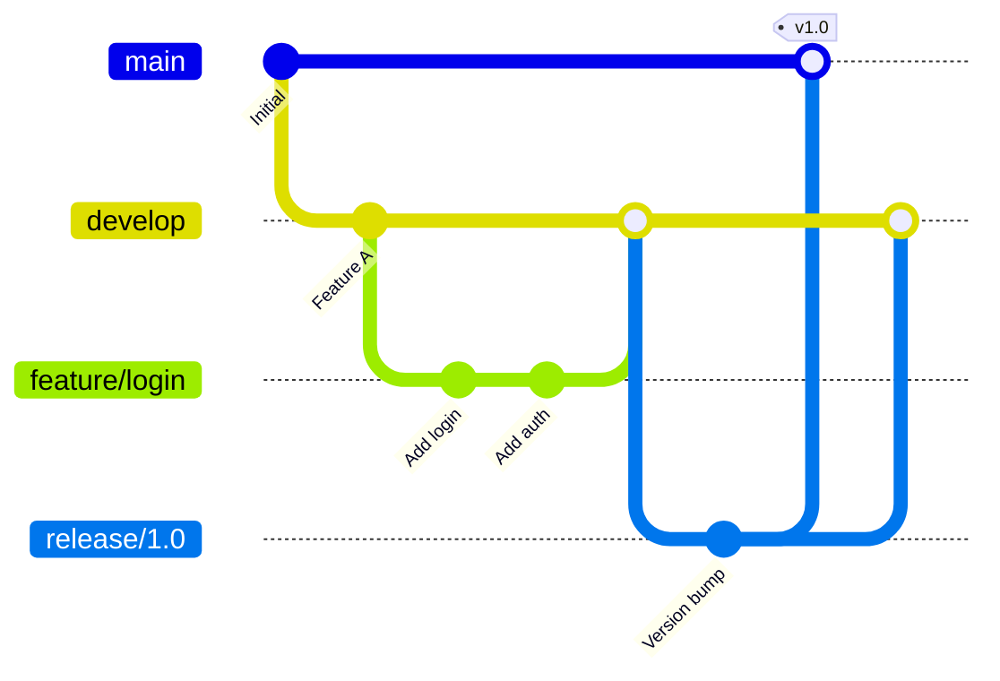
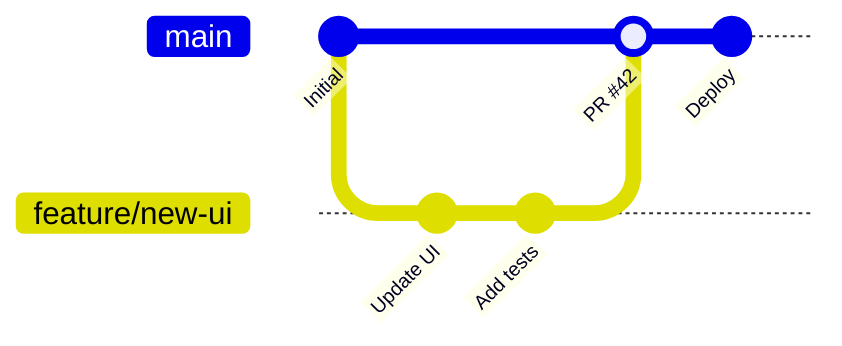

# Git Workflow Best Practices for Teams

Effective Git workflows are essential for team collaboration. Let's explore proven strategies.

## Branching Strategies

### Git Flow



**Best for:** Large projects with scheduled releases

### GitHub Flow



**Best for:** Continuous deployment, smaller teams

## Commit Message Conventions

### Conventional Commits

```
<type>(<scope>): <description>

[optional body]

[optional footer]
```

**Types:**
- `feat`: New feature
- `fix`: Bug fix
- `docs`: Documentation
- `style`: Formatting
- `refactor`: Code restructuring
- `test`: Adding tests
- `chore`: Maintenance

**Examples:**

```bash
# Feature
git commit -m "feat(auth): add OAuth2 login support"

# Bug fix
git commit -m "fix(api): resolve null pointer in user service"

# Breaking change
git commit -m "feat(api)!: change user endpoint response format

BREAKING CHANGE: User object now includes nested profile"
```

## Branch Naming Conventions

| Type | Pattern | Example |
|------|---------|---------|
| Feature | `feature/<description>` | `feature/user-authentication` |
| Bug Fix | `fix/<issue-id>-<description>` | `fix/123-login-error` |
| Hotfix | `hotfix/<description>` | `hotfix/security-patch` |
| Release | `release/<version>` | `release/2.0.0` |

## Pull Request Best Practices

### PR Template

```markdown
## Description
Brief description of changes

## Type of Change
- [ ] Bug fix
- [ ] New feature
- [ ] Breaking change
- [ ] Documentation update

## Testing
- [ ] Unit tests pass
- [ ] Integration tests pass
- [ ] Manual testing completed

## Checklist
- [ ] Code follows style guidelines
- [ ] Self-review completed
- [ ] Documentation updated
- [ ] No new warnings
```

### Code Review Guidelines

1. **Review promptly** - Aim for < 24 hours
2. **Be constructive** - Suggest improvements, not just problems
3. **Keep PRs small** - < 400 lines of change
4. **Use suggestions** - GitHub's suggestion feature is powerful

```markdown
```suggestion
const user = await fetchUser(id);
if (!user) throw new NotFoundError();
```
```

## Keeping History Clean

### Interactive Rebase

```bash
# Squash last 3 commits
git rebase -i HEAD~3

# In editor:
pick abc1234 First commit
squash def5678 Second commit
squash ghi9012 Third commit
```

### Amending Commits

```bash
# Fix last commit message
git commit --amend -m "New message"

# Add forgotten files to last commit
git add forgotten-file.ts
git commit --amend --no-edit
```

## Useful Git Aliases

Add to `~/.gitconfig`:

```ini
[alias]
    co = checkout
    br = branch
    ci = commit
    st = status
    lg = log --oneline --graph --decorate
    undo = reset HEAD~1 --soft
    amend = commit --amend --no-edit
    pr = pull --rebase
    sync = !git fetch origin && git rebase origin/main
```

## Handling Merge Conflicts

```bash
# 1. Update your branch
git fetch origin
git rebase origin/main

# 2. If conflicts occur
# Edit conflicted files

# 3. Mark as resolved
git add <resolved-files>

# 4. Continue rebase
git rebase --continue
```

## Protected Branches

Configure in GitHub/GitLab:

- ✅ Require pull request reviews
- ✅ Require status checks to pass
- ✅ Require linear history
- ✅ Restrict force pushes
- ✅ Require signed commits

## Summary

| Practice | Benefit |
|----------|---------|
| Conventional Commits | Automated changelogs |
| Small PRs | Faster reviews |
| Branch Protection | Code quality |
| Regular Rebasing | Clean history |
| Code Review | Knowledge sharing |

Follow these practices for smoother collaboration! 🎯
