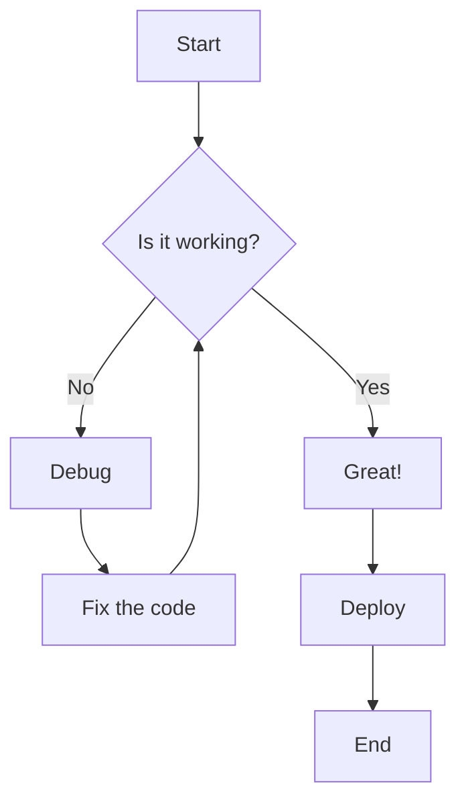
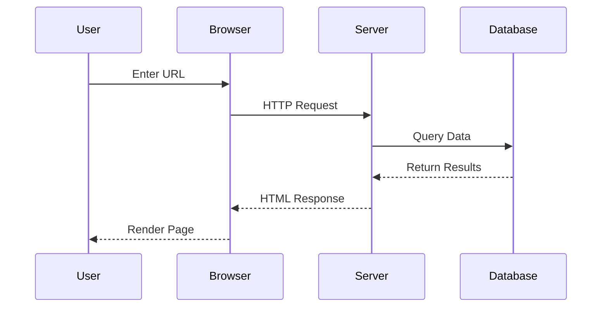
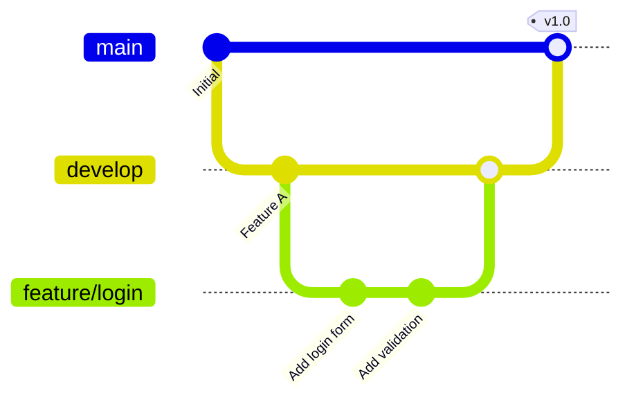
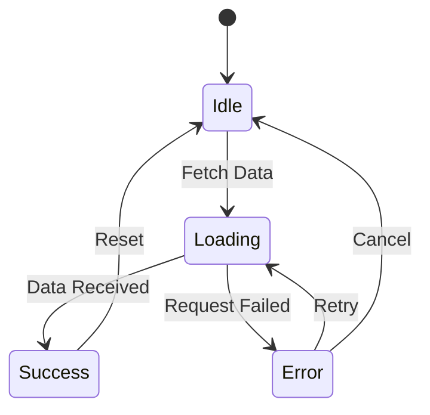
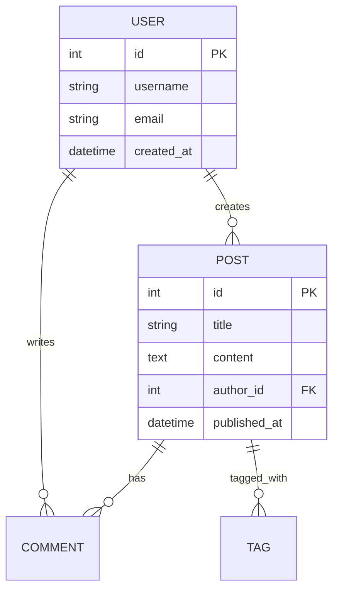
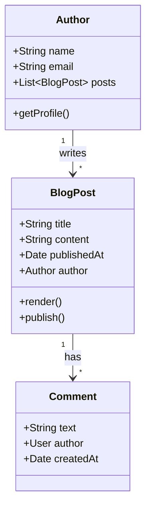
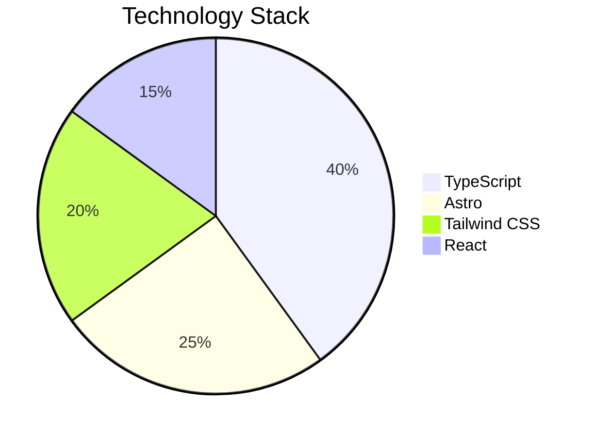

Mermaid is a powerful JavaScript library that allows you to create diagrams and visualizations using simple text-based syntax. This blog now supports Mermaid diagrams directly in Markdown!

## Getting Started with Mermaid

Simply wrap your diagram code in a code block with the `mermaid` language identifier. The diagram will be automatically rendered when the page loads.

## Flowchart Example

Flowcharts are great for visualizing processes and decision trees:

## Sequence Diagram

Perfect for showing interactions between components:

## Git Graph

Visualize your Git branching strategy:

## State Diagram

Great for showing state machines and transitions:

## Entity Relationship Diagram

Perfect for database schema visualization:

## Class Diagram

Useful for documenting code architecture:

## Pie Chart

Simple data visualization:

## Tips for Using Mermaid

1. **Keep it Simple**: Complex diagrams can be hard to read. Break them into smaller parts if needed.
2. **Use Colors**: Mermaid supports custom styling to highlight important elements.
3. **Dark Mode**: Diagrams automatically adapt to the current theme.
4. **Export**: Right-click on any diagram to save it as an image.

## Syntax Reference

For more diagram types and syntax options, check out the [official Mermaid documentation](https://mermaid.js.org/intro/).

Happy diagramming! 📊
